# MAPLE

## About MAPLE
MAPLE is a comprehensive, next-generation web-based Integrated Development Environment (IDE) designed to enhance the programming and learning experience. It provides a robust, in-browser coding environment powered by the Monaco Editor, supporting multiple languages including C++, Java, and Python. MAPLE goes beyond standard code execution by integrating intelligent features such as an AI-powered chat assistant, a visual debugger that graphically maps variable states and data structures, an automated complexity analyzer, and simplified error messages to accelerate the debugging process.

## Tech Stack
* **Frontend:** Next.js, React, Monaco Editor, Tailwind CSS
* **Backend:** Python, Flask 
* **Database:** AWS RDS (PostgreSQL/MySQL)
* **Infrastructure:** AWS EC2, Nginx, PM2/Gunicorn

## Screenshots

**Landing Page**
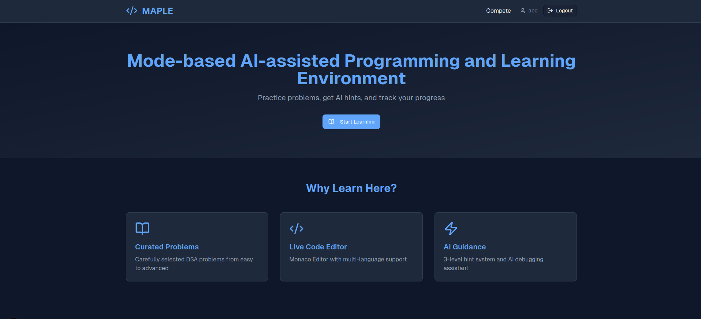

**Problem Selection**
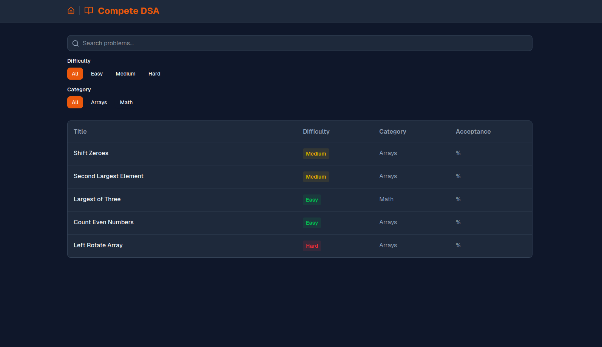

**Editor**
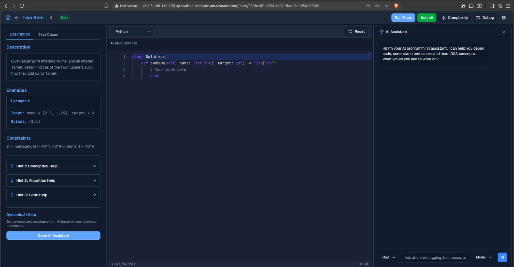

**Visual Debugger**
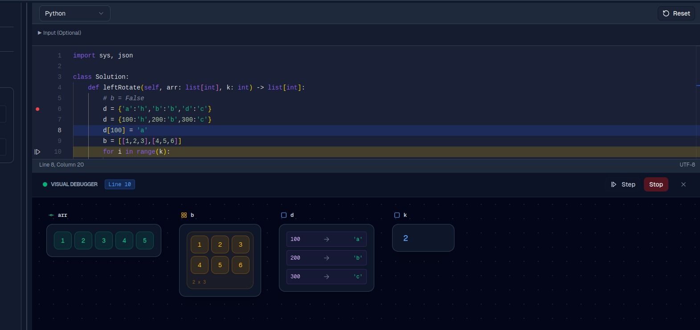

**AI Chat**
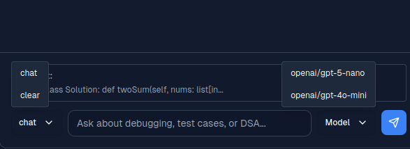

**Complexity Analyzer**
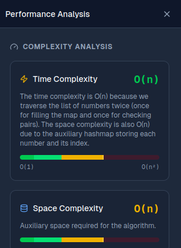

**Error Message Simplification**
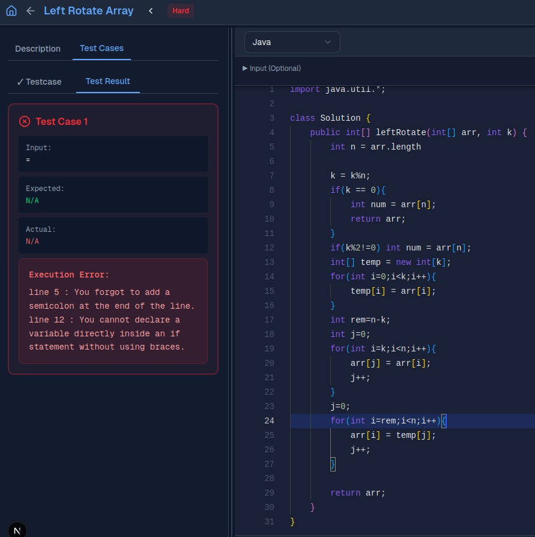

**Test Results**
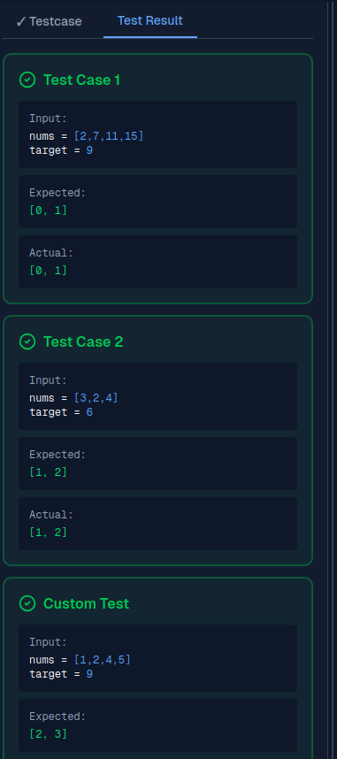

**Submit Results**
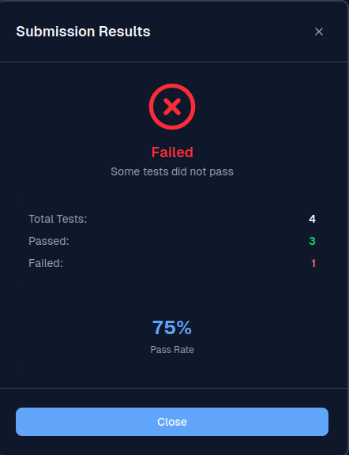

**Custom Testcase**
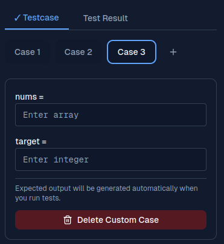

**Developer Preferences**
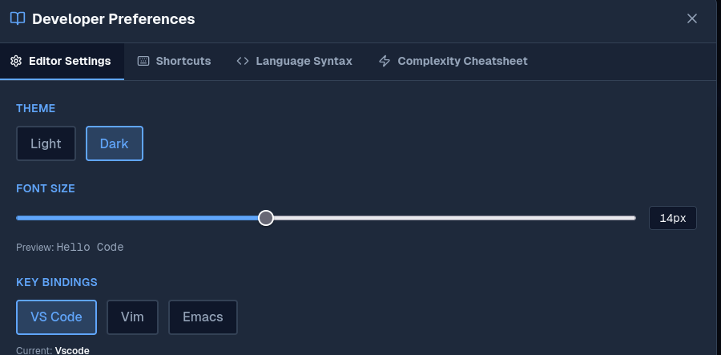

## Environment Variables Configuration
To run this project locally or in production, you must configure two separate environment files:
1. Create an `.env.local` file in the root `app` directory for frontend Next.js variables.
2. Create an `.env` file in the `app/backend` directory for Python backend variables (database credentials, API keys).

## Installation

**1. Clone the repository**
```bash
git clone [https://github.com/yourusername/maple.git](https://github.com/yourusername/maple.git)
cd maple
```

**2. Setup the Frontend**
```bash
# Install Next.js dependencies
npm install

# Start the development server
npm run dev
```

**3. Setup the Backend**
```bash
cd app/backend

# Create and activate a virtual environment
python -m venv venv
source venv/bin/activate  # On Windows use `venv\Scripts\activate`

# Install Python dependencies
pip install -r requirements.txt

# Start the backend server
python app.py
```

## Deployment

### AWS RDS Setup
1. Navigate to the AWS RDS Console and create a new database instance.
2. Ensure "Public Access" is configured appropriately or restricted to your EC2 security group.
3. Note the Endpoint URL, username, password, and database name.
4. Update the `app/backend/.env` file on your production server with these RDS credentials.

### AWS EC2 Setup
1. Launch an EC2 instance (Ubuntu Server recommended) and configure the Security Group to allow inbound traffic on ports `80` (HTTP), `443` (HTTPS), and `22` (SSH).
2. SSH into your instance and install the required system dependencies:
```bash
sudo apt update
sudo apt install nodejs npm python3-pip python3-venv nginx
```
3. Clone your repository to the EC2 instance and set up both the frontend and backend environment variables.

### Deploying the Application
**Backend (Gunicorn & PM2)**
```bash
cd maple/app/backend
python3 -m venv venv
source venv/bin/activate
pip install -r requirements.txt

# Use PM2 to manage the Gunicorn process
npm install -g pm2
pm2 start "gunicorn -w 4 -b 127.0.0.1:5000 app:app" --name maple-backend
```

**Frontend (Next.js)**
```bash
cd ../../
npm install
npm run build

# Start the Next.js production server with PM2
pm2 start npm --name "maple-frontend" -- start
```

**Reverse Proxy (Nginx)**
Configure Nginx to route traffic to your Next.js frontend and Flask backend.
```nginx
server {
    listen 80;
    server_name your_domain_or_ip;

    # Route API requests to Flask backend
    location /api/ {
        proxy_pass [http://127.0.0.1:5000/](http://127.0.0.1:5000/);
        proxy_set_header Host $host;
        proxy_set_header X-Real-IP $remote_addr;
    }

    # Route all other requests to Next.js frontend
    location / {
        proxy_pass [http://127.0.0.1:3000](http://127.0.0.1:3000);
        proxy_set_header Host $host;
        proxy_set_header X-Real-IP $remote_addr;
    }
}
```
Restart Nginx to apply the configuration:
```bash
sudo systemctl restart nginx
```