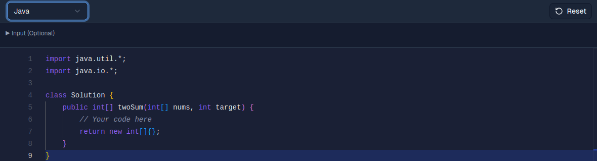
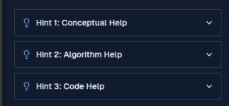
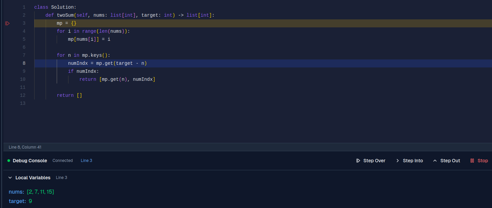

# MAPLE: Learn Page Student Guide

Welcome to the MAPLE Learn Page! This guide will walk you through all the tools available to help you solve coding problems effectively during the pilot study. 

---

## 1. The Code Editor
The main editor is where you will write your solution. 
* **Focus on Logic:** You only need to write the logic inside the provided function (e.g., `class Solution`). 
* **No Boilerplate Needed:** Do not worry about writing the `main()` function, reading standard input, or printing standard output (unless using the Optional Run Button, explained below). The platform handles the driver code automatically.
* Reset button to reset your code to default
* Change language to Python, C++


## 2. Viewing Hints
If you get stuck, the left panel contains hints to guide your thinking.
* **Three Levels:** There are up to 3 hints available per problem, usually progressing from a conceptual nudge to specific algorithmic advice.
* Click the dropdown arrow on any hint to reveal its contents.



## 3. Custom Testcases
You can test your code against your own specific scenarios before making a final submission.
* Navigate to the **Test Cases** tab on the left panel.
* Click **Add Custom Testcase** to create a new input scenario.
* Fill in the parameters exactly as the problem requires. 


## 4. Run Tests Button
Located in the top right navigation bar, this button is your primary way to check your work.
* Clicking **Run Tests** executes your code against the **public testcases** (the examples shown in the problem description) and any **custom testcases** you have added.
* Results, including expected vs. actual outputs, will appear in the Test Results section.


## 5. Submit Button
Once your code passes all the visible tests and you feel confident in your solution, it is time to submit.
* Located next to the Run Tests button, clicking **Submit** will evaluate your code against the public testcases **plus** a hidden suite of **private testcases**.
* You must pass all testcases to get an "Accepted" result.


## 6. Complexity Analyzer
Want to know how efficient your code is? 
* Click the **Complexity** button in the top right menu.
* The system will analyze your current code and provide the **Time Complexity** (e.g., O(N)) and **Space Complexity** along with the explaination.


## 7. The Debugger
Debugging is a crucial skill. You can execute your code line-by-line to see exactly what is happening.
* **Breakpoints:** Click to the left of the line numbers in the editor to add a red dot (breakpoint). This is where execution will pause.
* Click the **Debug** button in the top menu to start the session.
* **Controls:** 
  * **Step Over:** Move to the next line of code.
  * **Step Into:** Dive inside a function call to see its internal execution.
  * **Step Out:** Finish executing the current function and return to where it was called.
* A debug window will appear, allowing you to monitor how your variable values change in real-time.



## 8. Dev Preferences
Customize your workspace for maximum comfort.
* Click the **Settings/Gear icon** in the top right.
* Here, you can change your editor **Theme** (Light/Dark mode), adjust the **Font Size**, view useful **Keyboard Shortcuts**, and access a handy **Syntax Cheatsheet**.


## 9. The Optional "Run" Button (Raw Input)
*Note: This is an advanced feature and an alternative to Custom Testcases.*
* If you prefer to write raw text input, you can use the input field located just above the code editor (click "Input (Optional)" to expand).
* **Important:** If you use this raw input method, **no background driver code is executed**. You **must** write your own `main()` function, instantiate your solution class, parse the raw input, and print the output yourself.
* Input format generally follows:
  ```text
  Number of testcases (t)
  Array size
  Array elements...
  ```

## 10. AI Chatbot Assistant
* Stuck on a concept or getting a weird error? Ask the AI!
* Click the openAI assistant button.
* The right-hand panel houses an AI programming assistant that understands your current code and any errors you've encountered.

* Changing Models: If the default model is not responding well, click the "Model" dropdown at the bottom right of the chat window and switch from gpt-4o-mini to gpt-5-nano.

